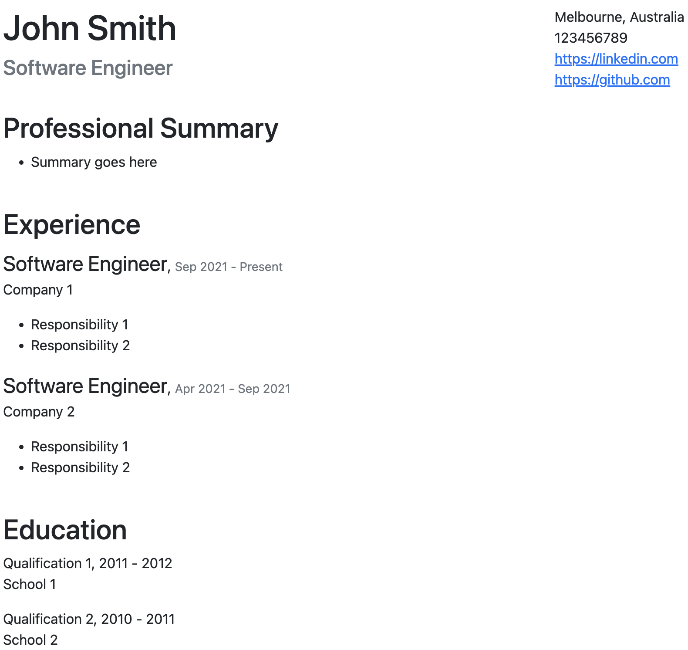

# HTML Resume Builder

Simple HTML resume builder if you do not like using word processors and if you
have a developer mindset to decouple data from presentation. Once you have the HTML, it can be printed as PDF.



## Requirements

- [Deno](https://deno.land/)
- HTML & CSS skills

## Usage

- Install [Deno](https://deno.land/manual/getting_started/installation). For
  example, on mac run the following:

  ```
  brew install deno
  ```

- To verify if it is working run the following:
  ```
  deno run --allow-read --allow-write src/run.ts --data=sample-data.json
  ```

  This will generate a sample `resume.html` in `./build` directory based on
  `sample-data.json` using `sample-template.html`. Behind the scene, the script
  uses [Eta](https://github.com/eta-dev/eta) as a templating engine and injects
  `data` into the template.

- Now you can copy `sample-data.json` and `sample-template.html` and modify them
  based on your details. The template uses [Bootstrap 5.2](https://getbootstrap.com/docs/5.2/getting-started/introduction/) for styling. To generate a new resume run the following:
  ```
  deno run --allow-read --allow-write src/run.ts --data=YOUR-DATA-FILE-PATH.json --template=YOUR-TEMPLATE-PATH.html
  ```
  Once you are happy with the result, you can print the page as a PDF.

## Run the tests

```
deno test --allow-read
```

## Format the files

```
deno fmt
```
